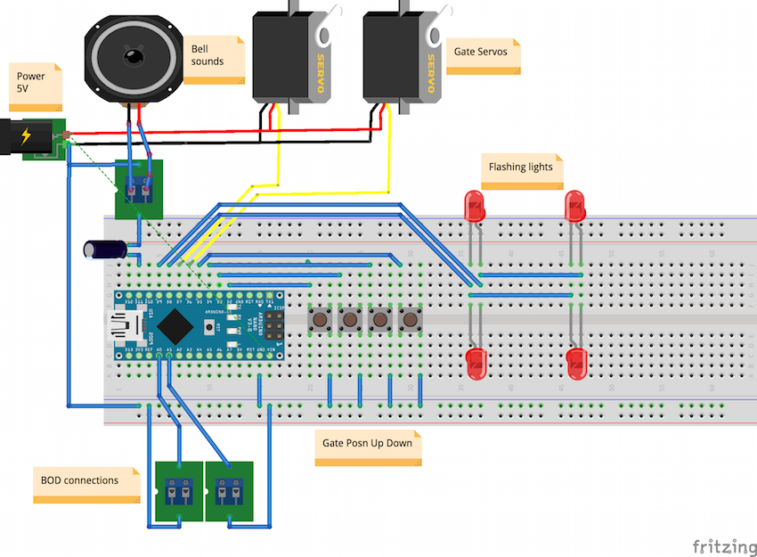
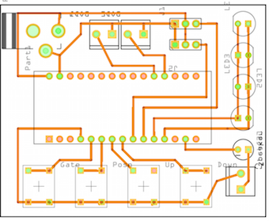

# GradeCrossingController
This is a project to implement a Level/Grade Crossing controller that features: 
  * BOD inputs
  * Aleternating crossing-light drive
  * bell sound
  * servo control for the gates
  * push-button adjustments
  * EEPROM storage of parameters
  * Parameter setting

It contains several variations: 
  * Arduino Nano - self-contained, parameter setting via usb connection
    * 
  * And could be made into a pcb, say: 
    * 

Other variants pending.
  
